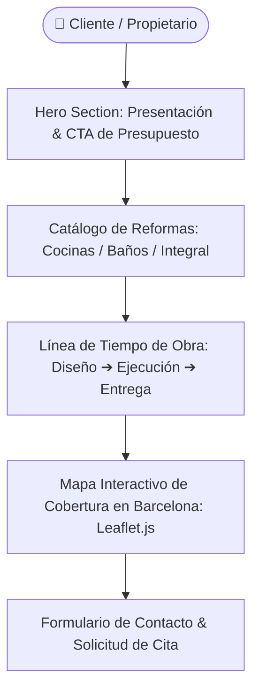

# Nova Reforma Barcelona — Sitio Web Corporativo de Reformas

<div align="center">


**Plataforma web corporativa y comercial para empresa de reformas integrales e interiorismo en Barcelona con catálogo de proyectos interactivo, línea de tiempo de obra y mapas dinámicos de cobertura con Leaflet.js.**

[🚀 Demo en Vivo](https://alxnrocha.github.io/site-reformas-barcelona/) • [📂 Repositorio en GitHub](https://github.com/alxnrocha/site-reformas-barcelona)

</div>

---

## 🏛️ Arquitectura y Flujo del Sistema



---

## ✨ Características Principales

- **Catálogo de Servicios y Proyectos:** Fichas interactivas de reformas de cocinas, baños e interiorismo con especificaciones técnicas y galerías de proyectos.
- **Proceso de Trabajo Paso a Paso:** Línea de tiempo visual que guía al cliente desde el diseño inicial hasta la entrega de llaves.
- **Mapa de Cobertura con Leaflet.js:** Visualización interactiva de áreas de servicio y proyectos concluidos en Barcelona y distritos adyacentes.
- **Accesibilidad y Soporte de Movimiento Reducido:** Estructura con soporte completo para navegación por teclado, roles ARIA y compatibilidad con `prefers-reduced-motion`.
- **SEO y Datos Estructurados:** Schema.org JSON-LD para negocio local, Open Graph y etiquetas canónicas.

---

## 🗂️ Estructura del Proyecto

```text
02-site-reformas-barcelona/
├── index.html                     # Documento HTML5 principal
├── src/
│   ├── assets/                    # Imágenes de proyectos e iconos vectoriales
│   ├── css/
│   │   └── styles.css             # Arquitectura CSS modular con variables de diseño
│   └── js/
│       └── main.js                # Lógica de interactividad y mapa Leaflet.js
├── LICENSE                        # Licencia MIT
└── README.md                      # Documentación del proyecto
```

---

## 🚀 Instalación y Puesta en Marcha

### Prerrequisitos
- Cualquier navegador web moderno (Chrome, Firefox, Edge, Safari).

### Ejecución Local
```bash
# 1. Clonar el repositorio
git clone https://github.com/alxnrocha/site-reformas-barcelona.git
cd site-reformas-barcelona

# 2. Servir localmente
npx serve .
```

---

## 🛠️ Tecnologías Utilizadas

| Capa | Tecnología | Aspectos Clave |
|---|---|---|
| **Estructura** | HTML5 Semántico | Schema.org JSON-LD, SEO tags y Open Graph |
| **Estilos** | CSS3 Moderno | Custom Properties, Grid Layout, Flexbox, `prefers-reduced-motion` |
| **Lógica** | JavaScript ES6+ | Módulos nativos, manipulación de estado DOM |
| **Mapas** | Leaflet.js | Mapa interactivo de distritos de Barcelona con OpenStreetMap |
| **Despliegue** | GitHub Pages | Despliegue estático continuo y optimizado |

---

<div align="center">
  <sub>Desarrollado con dedicación por <a href="https://github.com/alxnrocha">Alex Rocha</a> • Proyecto 02 del Portafolio Profesional Frontend.</sub>
</div>
